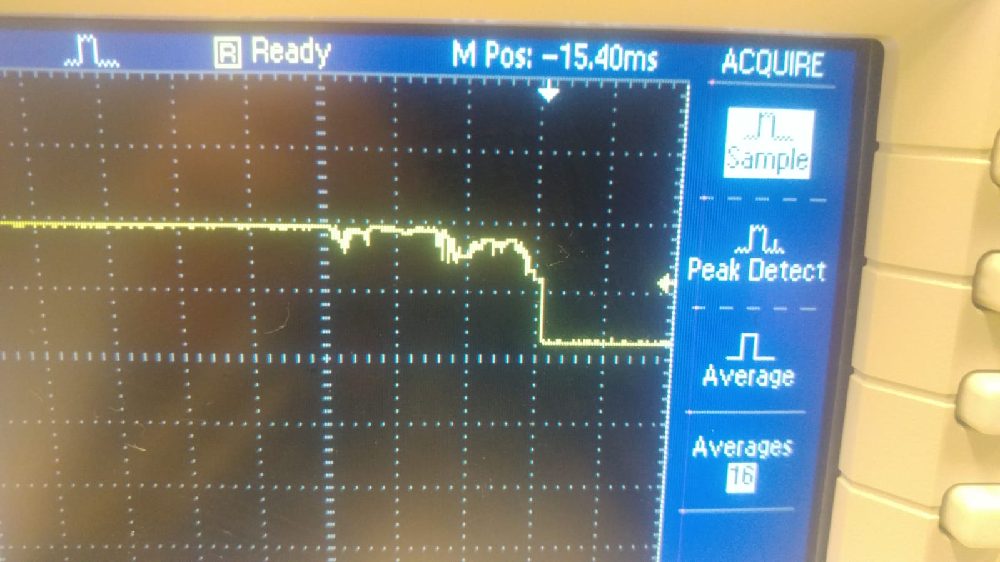

EIE3105_Debounce_Test
=====================
### Notes
- **Only oscilloscope can display bouncy signal**, MCU's ADC and cheap ADC ICs cannot
- 104 cap should be ok
- 10k for pull-up / pull-down
- RC circuit (second resister for debouncing both edges) looks like a voltage divider
  - [RC Circuits Physics Problems, Time Constant Explained, Capacitor Charging and Discharging - YouTube](https://www.youtube.com/watch?v=PLQrPqYlPmI) 
- Software delay
  - Lecture materials
  - [Raspberry Pi GPIO Switch Input - Part 1: Circuitry and Debouncing - YouTube](https://www.youtube.com/watch?v=tI6B6BRKU5k)
- Circuitry
  - [Debouncing mechanical push button switch with capacitor and resistor how to DIY electronics - YouTube](https://www.youtube.com/watch?v=JYXL_PPJghM)
  - [Debounce a Switch - YouTube](https://www.youtube.com/watch?v=e1-kc04jSE4)
- Schmitt trigger
  - [Schmitt trigger using IC 741 - Study of IC's - Application of Electronics - YouTube](https://www.youtube.com/watch?v=gFp9vttbFLQ)
  - **https://eopcw.com/assets/stores/Electrical%20Engineering%20Laboratory%20III/lecturenote_520626135Exp%209.pdf**
  - equation
    - 

### Arduino UNO basic specification
- [Arduino Uno Rev3 — Arduino Online Shop](https://store-usa.arduino.cc/products/arduino-uno-rev3#product-tech)

### 3V3 on current measurement

### Bouncy signal

### Potential PCB

### Simulations
- [**Simulating Arduino Using Proteus - 4 (Key Debouncing) - YouTube**](https://www.youtube.com/watch?v=8gVQI21X6Ns)

### TODOs
- [ ] what is the ampere value of 3v3 port (100-150mA?)
